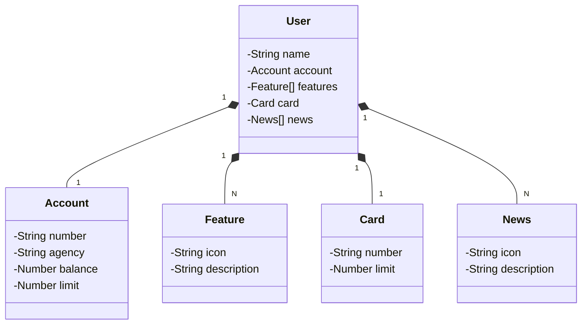

# Santander Bootcamp - Back-end Java 2024
Java RESTful API criada no Bootcamp Santander Back-end Java 2024. Utilizando como abstração o aplicativo mobile do Santander 

## Diagrama de Classes (Domínio API)

